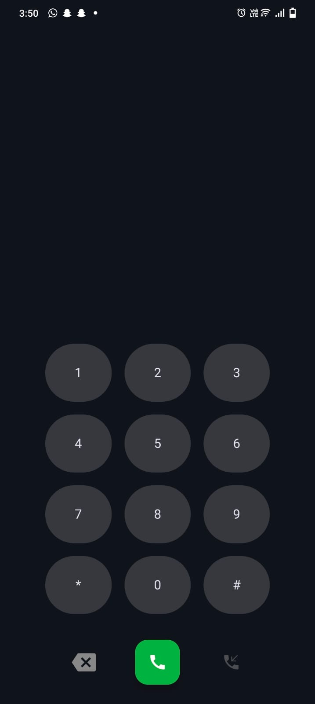
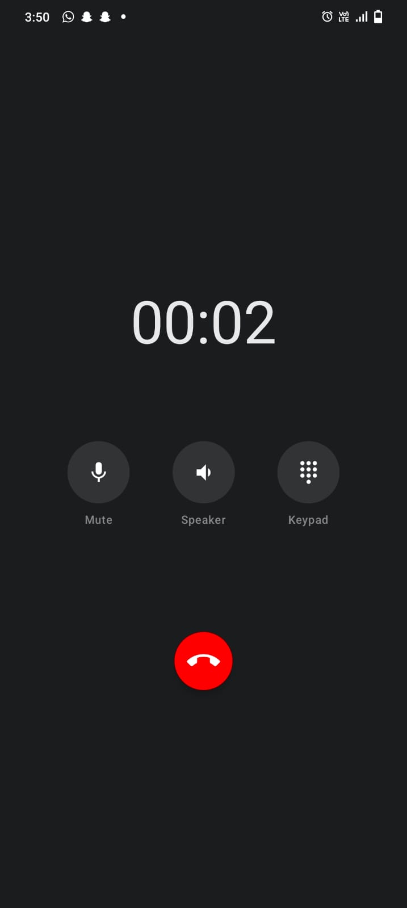

# Basic-Calling-App-Android

##  App Preview

  
  
  

A polished Android Dialer prototype built with **Jetpack Compose** and **Clean Architecture**.

## Features
* **Real SIM Integration:** Uses `ACTION_CALL` to trigger system dialing.
* **Smart Lifecycle Handling:** Detects call termination via `ON_RESUME` to auto-reset UI.
* **Call Simulation:** Full Incoming Call simulation with Accept/Reject logic.
* **Premium UI:** Material 3 components with 60fps slide transitions.
* 
## Tech Stack
* **Language:** Kotlin
* **UI:** Jetpack Compose
* **Navigation:** Compose Navigation with Animated Transitions
* **State Management:** ViewModel with StateFlow/SharedFlow 

## Key Technical Challenges
1. The System Transition Sync: Integrating with the native Android Dialer created a state-sync challenge. I implemented a LifecycleEventObserver to monitor     ON_RESUME events, allowing the app to intelligently detect when a user returns from a system call and reset the internal timer/state accordingly.
2. Navigation Architecture: Used a Sealed Class for type-safe routing and implemented custom AnimatedContentTransitionScope to provide a high-end, snappy feel that mimics native Material Design behavior.
3. Permission Handshake: Built a robust ActivityResultLauncher flow that handles edge cases where users might deny the CALL_PHONE permission, ensuring the app doesn't crash and provides helpful feedback.

## Screen Flow
1. Dialer: Intuitive T9-style keypad
2. Outgoing: Branded transition screen before handing off to the System Dialer.
3. Active: Ticking call duration with functional Mute/Speaker toggles.
4. Incoming: A full simulation of the call-reception experience.

## How to Run
1. Clone the repository.
2. Open in Android Studio Ladybug (or newer).
3. Ensure you have a SIM card installed for the "Real Call" feature, or use the "Simulate" button on the DialPad to test the UI flow on an emulator.  
